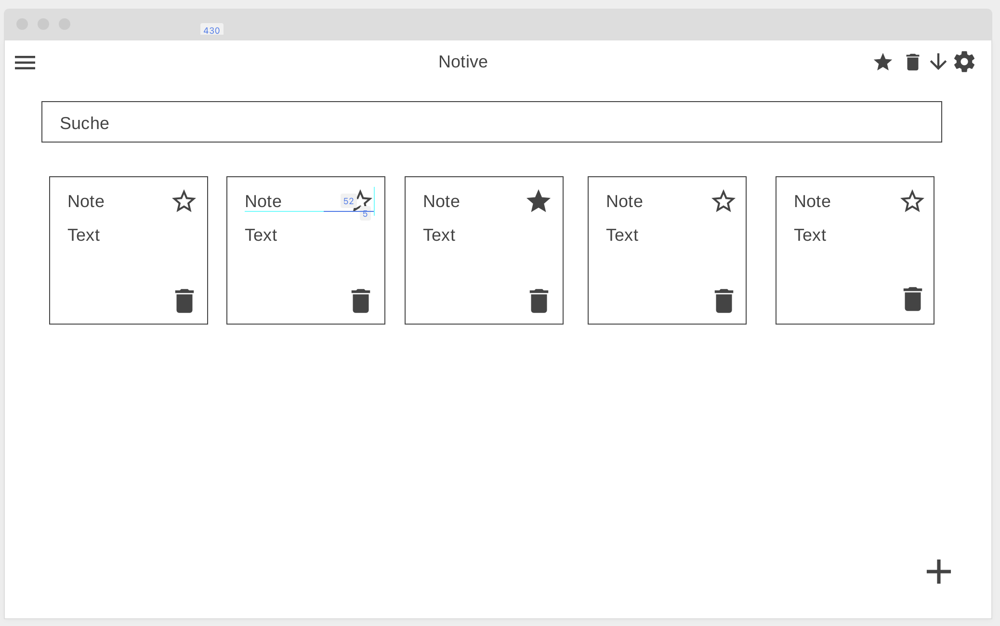
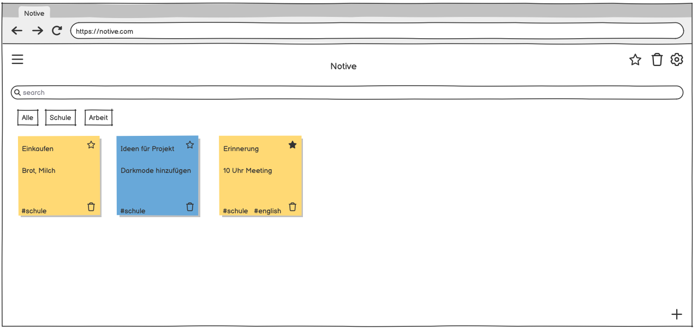
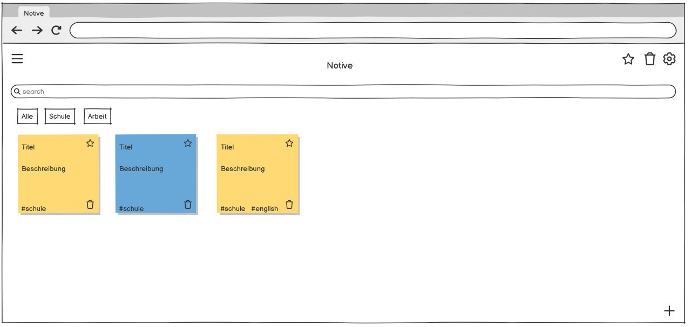
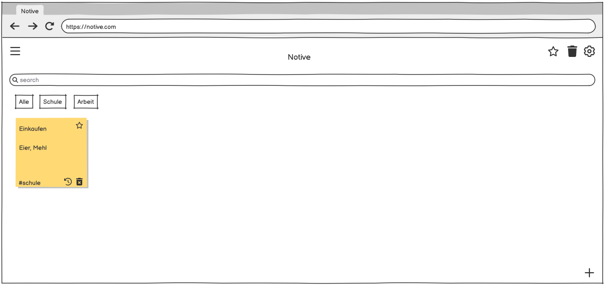
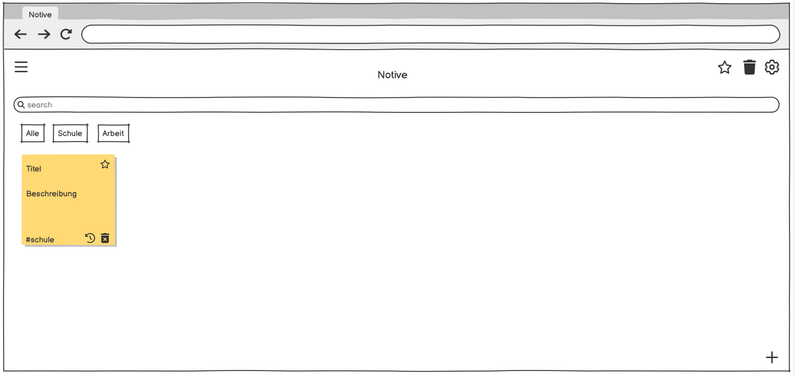
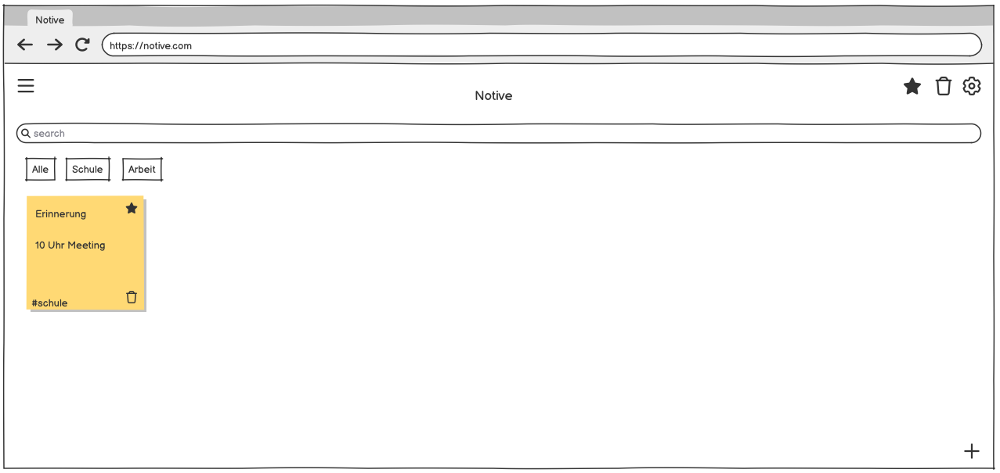
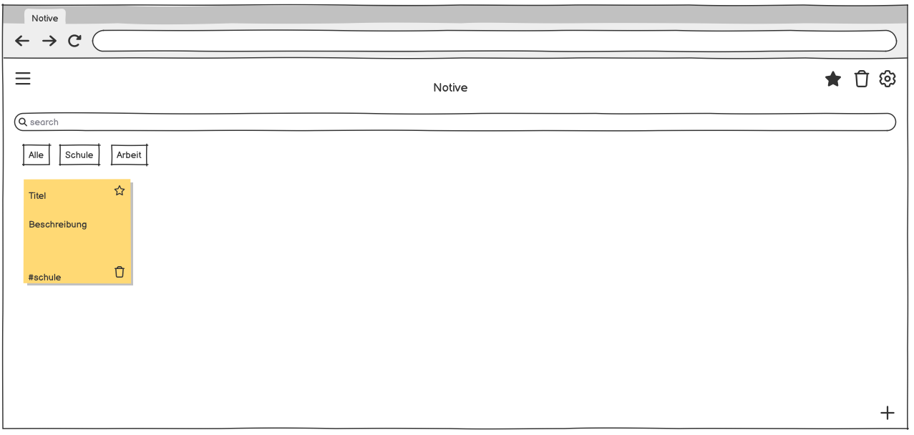
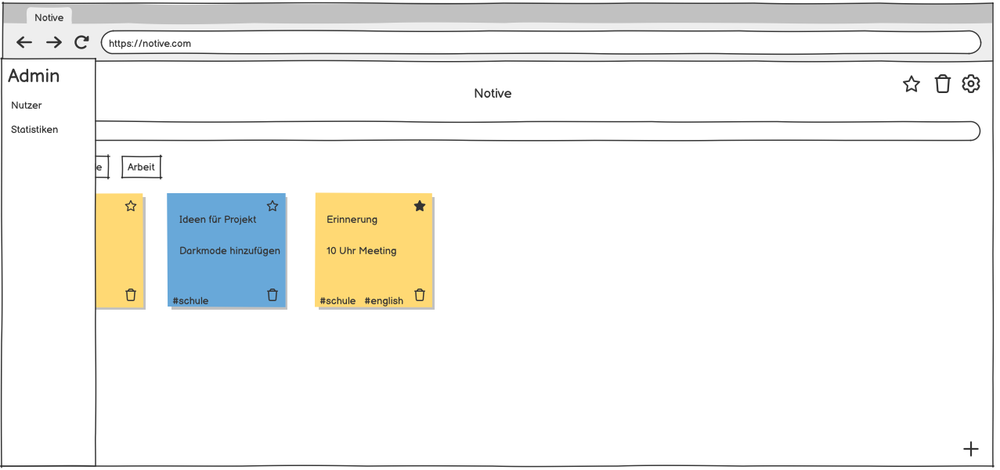
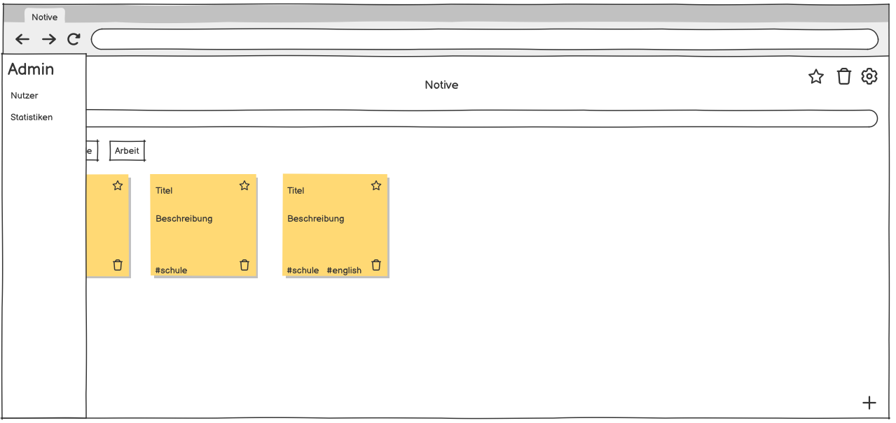

# Notive App

## Ziel der App
Das Ziel der App ist die einfache und schnelle Verwaltung von Notizen. Nutzerinnen und Nutzer erstellen Notizen, ordnen sie übersichtlich in farbige Gruppen, und markieren wichtige Einträge als Favoriten, um sie schneller wiederzufinden. Durch die Anmeldung sind persönliche Notizen zugriffsgeschützt und nur für die jeweiligen Besitzer sichtbar.

---

## Funktionen

### Notizen
- Es können Notizen erstellt, bearbeitet und gelöscht werden.  
- Man kann ihnen einen Titel, eine Beschreibung, eine Gruppe, eigene Tags geben und sogar Bilder hochladen.  
- Wenn eine Notiz gelöscht wird, heisst das nicht, dass sie weg ist, sondern sie kommt in den Papierkorb, bis sie komplett gelöscht wird.  
- Notizen können zu den Favoriten hinzugefügt werden, damit man sie besser findet.

### Gruppen
- Jeder Nutzer kann eigene Gruppen mit Name und einer Farbe erstellen.  
- Die Notizen der Gruppe werden dann in der jeweiligen Farbe angezeigt, dadurch hat man einen besseren Überblick über seine Notizen.

### Einstellungen
- In den Einstellungen kann man seinen Display Name anpassen.  
- Dieser Name wird den Admins auf den Admin-Seiten als Namen angezeigt, wenn keiner vorhanden ist, sehen sie die Id des Nutzers.  
- Außerdem sieht man in den Einstellungen einen Überblick über die Tastaturkürzel.

### AI Chatbot
- Es gibt einen Chatbot, der auf **OpenAI GPT-3.5-Turbo** basiert.  
- Mit ihm kann man chatten und ihm Fragen stellen.
- Wenn man mit "Notiz:" anfängt, wird eine Notiz mit allem was danach kommt erstellt.
- Wenn man nach "Notiz:" noch "titel:" und "beschreibung:" schreibt, kann man nach dem doppelpunkt noch sagen was Titel und was Beschreibung sein soll.

### Sortierung
- Man kann seine Notizen auf verschiedene Arten anzeigen lassen.  
- Standardmäßig werden einfach alle angezeigt.  
- Man kann zuerst neue oder alte anzeigen lassen.  
- Man kann nach den verschiedenen Gruppen sortieren.  
- Es gibt die Möglichkeit, Favoriten, den Papierkorb oder beides zusammen anzuzeigen.

### NavMenu
- Oben auf der Seite gibt es ein Navigationsmenü.  
- Dort kann man:
  - Neue Gruppen erstellen  
  - Favoriten und/oder Papierkorb anzeigen  
  - Chatbot öffnen  
  - Nach Alter aufwärts/abwärts sortieren  
  - Die Einstellungen öffnen  
- Admins haben außerdem noch ein Burger-Menü, mit welchem sie auf die beiden Admin-Seiten gelangen.

---
## Admin Funktionen

#### Benutzerverwaltung
- In der Benutzerverwaltung können Admins alle User mit Notizen sehen.  
- Sie können deren Notizen anzeigen und im Notfall auch löschen.  
- Das ist wichtig, um die Website gut zu verwalten.

#### Statistiken
- Für Admins gibt es auch noch eine Statistik-Seite.  
- Dort sehen sie aktuelle Statistiken wie die Anzahl Notizen, wann sie erstellt wurden, aktivste Nutzer, etc.
---

## Design
Ich habe beim Design darauf geachtet, dass die App übersichtlich und einfach zu bedienen ist.
Die Farben sind bewusst eher dezent und hell gewählt, damit die Inhalte im Vordergrund stehen.
Durch das Postit Design der Notizen, kann man die Notizen einfach unterscheiden und hat eine bessere User Experience.
Dadurch das Gruppen eigene Farben haben, hat man schneller und besser Notizen auseinander halten und hat einen besseren Überlick.

---

## Navigation
Durch Tooltips und passende Icons hat man eine einach verständliche Navigation.
Der grossteil der Navigation findet im NavMenu im Header der Seite statt. Dadurch hat man alles an einem Ort.
Für Admins gibt es zusätzlich noch ein Burger Menu mit eigenen Seiten. Das Burger Menu ist gewählt damit man Admin von normalen Seiten unterscheiden kann und wenn noch mehr Seiten dazu kommt das NavMenu nicht zu vollgesopft aussieht.

---

## Shortcuts
- ⌘/Ctrl + F = Suche  
- ⌘/Ctrl + K = Neue Notiz  
- ⌘/Ctrl + L = Favoritenfilter  
- Shift + S = Sortierung  

Shortcuts können je nach Betriebssystem und Browser Probleme machen!

---
## Seiten
- Login/Registrieren
- Dashboard
- Detail / Edit
- Einstellungen
- Chatbot
- Benutzerverwaltung
- Statistiken

---

## Users
### Admin
- **E-Mail:** admin@gmail.com  
- **Passwort:** Admin1234  

### User
- **E-Mail:** user@gmail.com  
- **Passwort:** User1234  

---

## Zusätzliche Daten
### Datenbank
[supabase](https://supabase.com)

### Deploy
[firebase](https://firebase.com)

### Website
[notive.com](https://flutter-test-c2aca.web.app)

---

### Wireframe

### Mockup

Home:

<!--  -->

Papierkorb:

<!--  -->

Favoriten:

<!--  -->

Burger Menu:

<!--  -->
