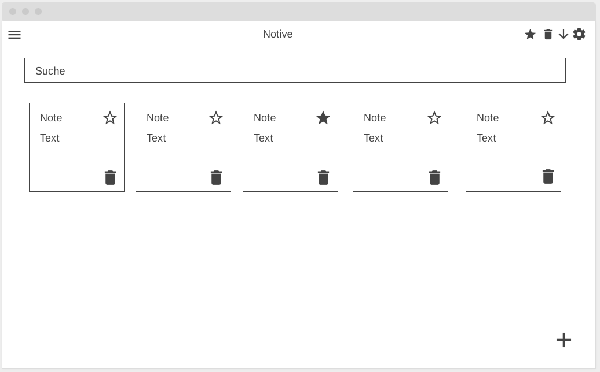

# Notive App

## Ziel der App
Das Ziel der App ist die einfache und schnelle Verwaltung von Notizen. Nutzerinnen und Nutzer erstellen Notizen, ordnen sie übersichtlich in farbige Gruppen, und markieren wichtige Einträge als Favoriten, um sie schneller wiederzufinden. Durch die Anmeldung sind persönliche Notizen zugriffsgeschützt und nur für die jeweiligen Besitzer sichtbar.

---

## Vorgehen
Am Anfang habe ich mir überlegt, wie die App ungefähr aussehen soll und was sie können muss.
Um die Struktur zu planen, habe ich ein Wireframe gezeichnet. Damit konnte ich schon grob sehen, wie die Navigation und die Seiten aufgebaut sind.
Danach habe ich ein paar Mockups erstellt, um Farben, Icons und das Layout der Sticky Notes festzulegen.
Als ich das Design grob stehen hatte, habe ich Schritt für Schritt die Funktionen eingebaut: zuerst Login/Registrierung, dann Notizen erstellen und bearbeiten, danach Gruppen und Tags, Favoriten und Papierkorb.
Zum Schluss habe ich die Admin-Seiten und den AI-Chat eingebaut.

## Begründung
Ich habe bewusst zuerst einfache Skizzen und Mockups gemacht, bevor ich mit dem Coden angefangen habe.
So konnte ich viele Designentscheidungen früh treffen und musste mich später beim Programmieren nicht ständig fragen, wie es aussehen soll.
Das hat den Prozess viel effizienter gemacht, weil ich mich dann voll auf die Funktionen konzentrieren konnte.

---

## Design
Das Design habe ich bewusst einfach und hell gehalten, damit die Inhalte im Vordergrund stehen.
Die Sticky Notes erinnern an Post-its und machen die Notizen visuell angenehmer.
Jede Gruppe hat eine eigene Farbe, damit man schnell den Überblick behält.
Mit Icons und Tooltips in der Navigation findet man sich schnell zurecht, auch wenn man die App zum ersten Mal benutzt.

---

## Navigation
Die Navigation läuft hauptsächlich über das obere NavMenu, wo man alles Wichtige an einem Ort findet: neue Gruppen, Favoriten, Papierkorb, Chat, Sortierung und Einstellungen.
Admins haben zusätzlich ein Burger-Menü mit eigenen Seiten (Benutzerverwaltung und Statistiken). Das Burger-Menü habe ich bewusst gewählt, damit die Admin-Funktionen klar getrennt sind.

---

## Funktionen

### Notizen
- Es können Notizen erstellt, bearbeitet und gelöscht werden.  
- Man kann ihnen einen Titel, eine Beschreibung, eine Gruppe, eigene Tags geben und sogar Bilder hochladen.  
- Wenn eine Notiz gelöscht wird, heisst das nicht, dass sie weg ist, sondern sie kommt in den Papierkorb, bis sie komplett gelöscht wird.  
- Notizen können zu den Favoriten hinzugefügt werden, damit man sie besser findet.

### Gruppen
- Jeder Nutzer kann eigene Gruppen mit Name und einer Farbe erstellen.  
- Die Notizen der Gruppe werden dann in der jeweiligen Farbe angezeigt, dadurch hat man einen besseren Überblick über seine Notizen.

### Einstellungen
- In den Einstellungen kann man seinen Display Name anpassen.  
- Dieser Name wird den Admins auf den Admin-Seiten als Namen angezeigt, wenn keiner vorhanden ist, sehen sie die Id des Nutzers.  
- Außerdem sieht man in den Einstellungen einen Überblick über die Tastaturkürzel.

### AI Chatbot
- Es gibt einen Chatbot, der auf **OpenAI GPT-3.5-Turbo** basiert.  
- Mit ihm kann man chatten und ihm Fragen stellen.
- Wenn man mit "Notiz:" anfängt, wird eine Notiz mit allem was danach kommt erstellt.
- Wenn man nach "Notiz:" noch "titel:" und "beschreibung:" schreibt, kann man nach dem doppelpunkt noch sagen was Titel und was Beschreibung sein soll.

### Sortierung
- Man kann seine Notizen auf verschiedene Arten anzeigen lassen.  
- Standardmäßig werden einfach alle angezeigt.  
- Man kann zuerst neue oder alte anzeigen lassen.  
- Man kann nach den verschiedenen Gruppen sortieren.  
- Es gibt die Möglichkeit, Favoriten, den Papierkorb oder beides zusammen anzuzeigen.

### NavMenu
- Oben auf der Seite gibt es ein Navigationsmenü.  
- Dort kann man:
  - Neue Gruppen erstellen  
  - Favoriten und/oder Papierkorb anzeigen  
  - Chatbot öffnen  
  - Nach Alter aufwärts/abwärts sortieren  
  - Die Einstellungen öffnen  
- Admins haben außerdem noch ein Burger-Menü, mit welchem sie auf die beiden Admin-Seiten gelangen.

---
## Admin Funktionen

#### Benutzerverwaltung
- In der Benutzerverwaltung können Admins alle User mit Notizen sehen.  
- Sie können deren Notizen anzeigen und im Notfall auch löschen.  
- Das ist wichtig, um die Website gut zu verwalten.

#### Statistiken
- Für Admins gibt es auch noch eine Statistik-Seite.  
- Dort sehen sie aktuelle Statistiken wie die Anzahl Notizen, wann sie erstellt wurden, aktivste Nutzer, etc.

---

## Shortcuts
- ⌘/Ctrl + F = Suche  
- ⌘/Ctrl + K = Neue Notiz  
- ⌘/Ctrl + L = Favoritenfilter  
- Shift + S = Sortierung  

Shortcuts können je nach Betriebssystem und Browser Probleme machen!

---

## Seiten
- Login/Registrieren
- Dashboard
- Detail / Edit
- Einstellungen
- Chatbot
- Benutzerverwaltung (Admin)
- Statistiken (Admin)

---

## Users
### Admin
- **E-Mail:** admin@gmail.com  
- **Passwort:** Admin1234  

### User
- **E-Mail:** user@gmail.com  
- **Passwort:** User1234  

---

## Wireframe / Mockup

### Wireframe

### Home:

### Papierkorb:

### Favoriten:

### Burger Menu:

---

## Zusätzliche Daten
### Datenbank Tool
[supabase](https://supabase.com)

### Deploy Tool
[firebase](https://firebase.com)

### Wireframe Tool
[wireframe](https://wireframe.cc)

### Mockup Tool
[balsamiq](https://balsamiq.cloud)

### Website
[notive.com](https://flutter-test-c2aca.web.app)
